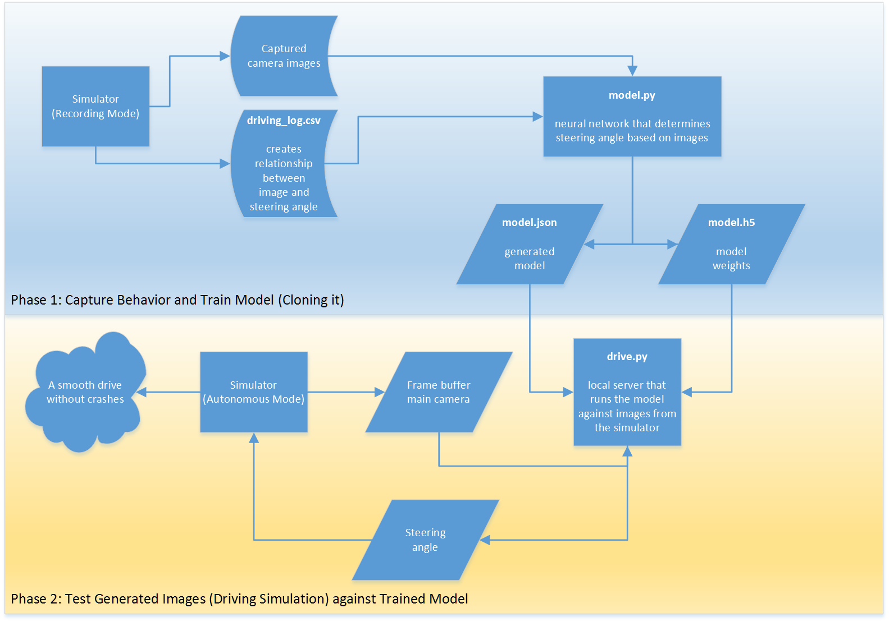
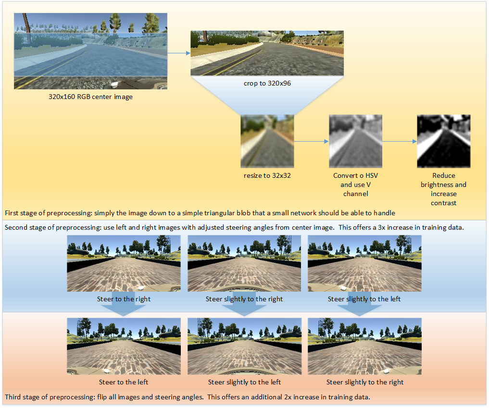

#Project Overview

This project will analyze the output of a driving simulation and predict the appropriate steering angle.  The overall flow will look like the following:

##Proprocessing of Images and Data

The first goal is to simplify the data so that the model can also be simple.  Then we need enough data so that it can generalize.

##The network

Add diagram here