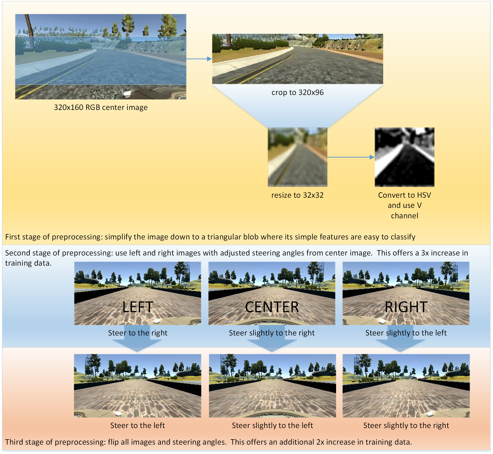

#Project Overview

This project will analyze the output of a driving simulation and predict the appropriate steering angle.  The overall flow will look like the following:

##Proprocessing of Images and Data

The first goal is to simplify the data so that the model can also be simple.  Then we need enough data so that it can generalize.

##Model overview

This is a basic model starting with normalization, 2d convolution with rectified linear unit activation which then gets pooled and dropped and flattened.

###Keras model summary
|____________________________________________________________________________________________________
|Layer (type)                     Output Shape          Param #     Connected to                     
|====================================================================================================
|lambda_1 (Lambda)                (None, 32, 32, 1)     0           lambda_input_1[0][0]             
|____________________________________________________________________________________________________
|convolution2d_1 (Convolution2D)  (None, 30, 30, 16)    160         lambda_1[0][0]                   
|____________________________________________________________________________________________________
|maxpooling2d_1 (MaxPooling2D)    (None, 7, 7, 16)      0           convolution2d_1[0][0]            
|____________________________________________________________________________________________________
|dropout_1 (Dropout)              (None, 7, 7, 16)      0           maxpooling2d_1[0][0]             
|____________________________________________________________________________________________________
|flatten_1 (Flatten)              (None, 784)           0           dropout_1[0][0]                  
|____________________________________________________________________________________________________
|dense_1 (Dense)                  (None, 1)             785         flatten_1[0][0]                  
|====================================================================================================
|Total params: 945
|Trainable params: 945
|Non-trainable params: 0
|____________________________________________________________________________________________________